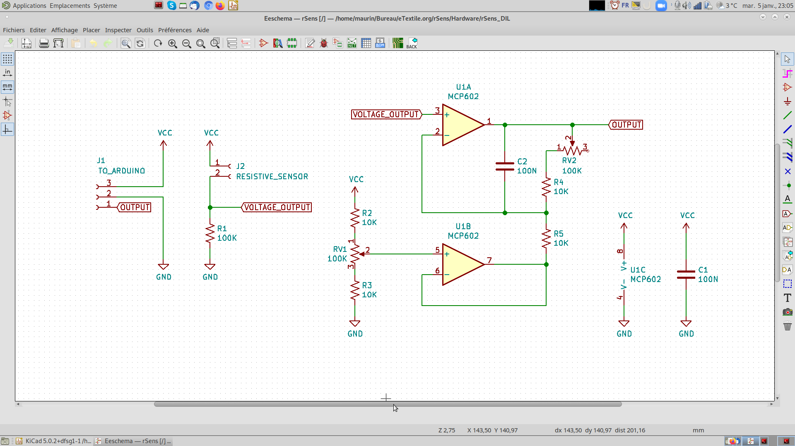

# rSens / Hardware
## E-textile resistive sensors signal conditioning
### How to improve your resistive sensor (FSR) sensitivity

- Team project:
    - **Pauline Vierne** <pauline.vierne[AT]gmail.com>
    - **Maurin Donneaud** <maurin[AT]etextile.org>
- Repository: https://github.com/eTextile/rSens/tree/master
- Project web page: http://rsens.eTextile.org (TODO)
- License: CC-BY-SA (see the License file)

## Hardware folder
- This folder is contaning two versions of the project.
- **rSens_DIL** is a proof of concept that has been done for an e-Textile one stage performance.
- **rSens_SMD** is a redesign that has been done to optimize the form factor of the PCB and add a second amplification line.
- All source files are made with [KiCad](https://kicad.org/) 5.0.* 



## Prerequisite
Calculate the onboard DIL resistor **R1** using the included Python script [R1_calculator.py](../docs/R1_calculator.py)
This Python script will automatically calculate the resistor value that you need to get the best voltage divider efficiency.

To run this script you will first need to get your sensor characteristics by using a conventional multimeter. Then you will use these values as arguments to run the script :

1. **First Arg** is the resistivity (in Ohm) of your FSR sensor at rest
2. **Second Arg** is the resistivity (in Ohm) of your FSR sensor at maximum effort

```
cd rSens/docs
```
```
python R1_calculator.py 200 3450
```

3. If you run the script with the above arguments you must get the following result

```
R1 = 830 Ohm
Efficiency = 61.19 %
```
5. After all you can solder the calculated R1 resistor onto the PCB

## BOM rSens_SMD
| Référence                | Def                                               | Quantity | Value        |
|:-------------------------|:--------------------------------------------------|----------|:-------------|
|  R6,R8,R9,R7,R5,R4,R3,R2 | R_0805_2012Metric_Pad1.20x1.40mm_HandSolder       |    8     |  10K	     |
|  R1,R10                  | R_Axial_DIN0309_L9.0mm_D3.2mm_P12.70mm_Horizontal |    2     |  USER_DEFINE |
|  C2,C3,C1                | C_0805_2012Metric_Pad1.18x1.45mm_HandSolder       |    3     |  100N	     |
|  RV2,RV1,RV3,RV4         | C_0805_2012Metric_Pad1.18x1.45mm_HandSolder       |    4     |  100K	     |
|  U2                      | TSSOP-14_4.4x5mm_P0.65mm                          |    1     |  MCP6244	 |

## PCB specifications
- **Base Material** : FR-4 TG130
- **No. of Layers** : 2 layers
- **PCB Dimensions** : 70mm / 76mm
- **No. of Different Designs** : 1
- **PCB Thickness** : 1.00 mm
- **PCB Color** : Black
- **Surface Finish** : ENIG
- **Minimum Solder Mask Dam** : 0.4mm
- **Copper Weight** : 1oz.
- **Minimum Drill Hole Size** : 0.3mm
- **Trace Width / Spacing** : 6/6 mil
- **Plated Half-holes / Castellated Holes** : Yes
- **Impedance Control** : No

# External links
- Article : A Comprehensive Review of Sensors and Instrumentation Methods in Devices for Musical Expression
- op-Amp datasheet : TODO
- [Voltage divider](https://en.wikipedia.org/wiki/Voltage_divider)
